# 11 — What the figures and the report actually show

A walkthrough of the report (`report/report.html`) top to bottom, saying what
each graph is and what the reader should take from it. Each figure is embedded
below from `figures/`, and is also at that path.

## Before the figures: the two fixed blocks

- **Blocker banner** (top of the page): the open instructor question — may the
  dataset be swapped? Everything below is built so the question can be asked
  with evidence, not as a claim that the answer is yes.
- **Final block**: the manual checklist (what you must do by hand), plus the
  licence position. The licence is *not asserted* — cricsheet.org's licence
  page 404s, so attribution is by filename, URL and retrieval date only.

## Stage 1 — REAL-WORLD DATA

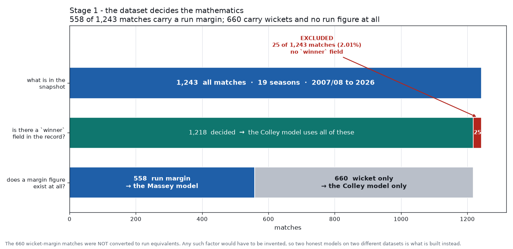

A funnel chart of the 1,243 committed matches — how many carry a run margin
(558), how many only a wicket margin (660), and how many have no winner (25:
16 Super Over ties + 9 abandonments). **Point:** the exclusion counts are
stated out loud, not footnoted. No model uses the 25, and none is allowed to
forget it.

## Stage 2 — MATRIX REPRESENTATION

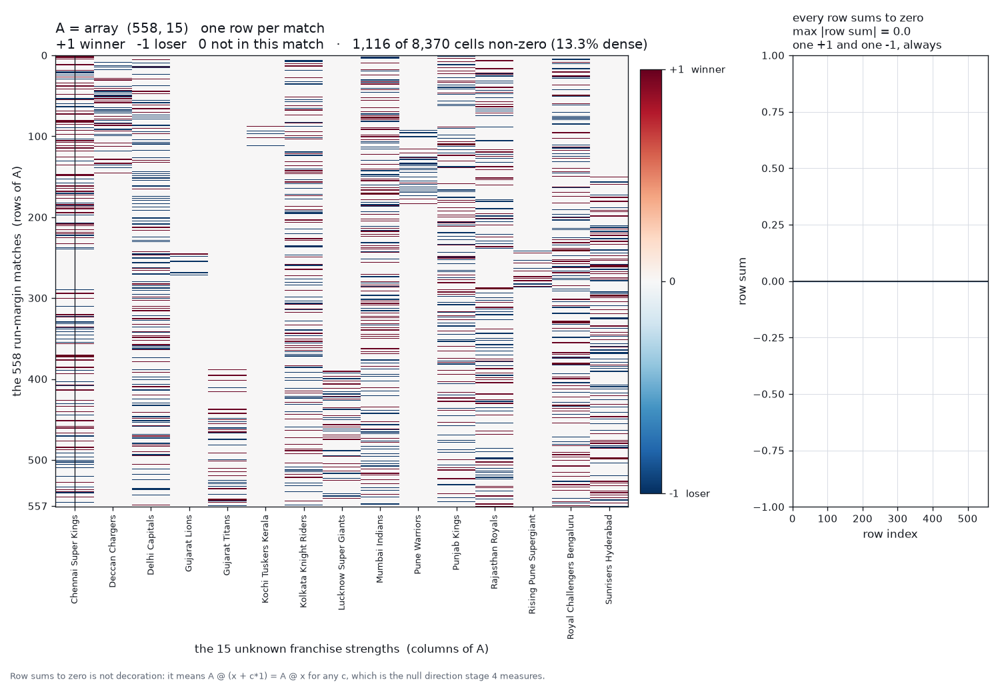

The 558 × 15 design matrix `A` as a heatmap of +1 (team won), −1 (team lost)
and 0. **Point:** one match is one linear equation in 15 unknowns; every row
sums to zero (exactly two non-zeros), which is the origin of stage 4's result.

## Stage 3 — MATRIX SIMPLIFICATION

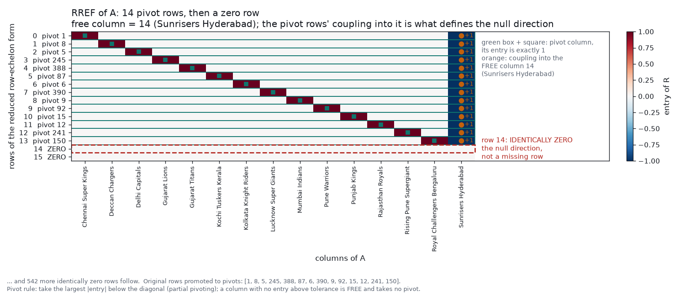

The RREF of `A` produced by the hand-written Gauss–Jordan elimination.
**Point:** only 14 of the 15 columns are pivots — the reduction *is* the rank
measurement, not an assertion.

## Stage 4 — STRUCTURE OF THE SPACE

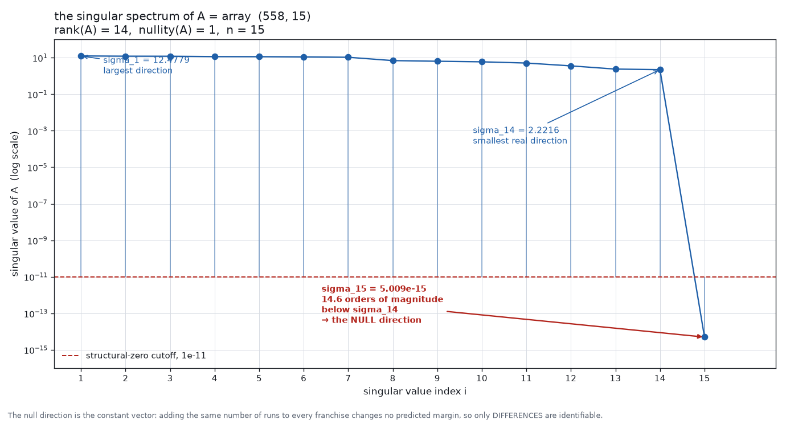

The singular spectrum of `A` — 14 non-zero singular values and one exactly
structural zero. **Point:** rank 14, nullity 1. The missing direction is the
constant vector: `A @ 1 = 0`, so only margin *differences* are identifiable.
This is the gauge freedom that later explains stage 8's negative R².

## Stage 5 — REMOVE REDUNDANCY

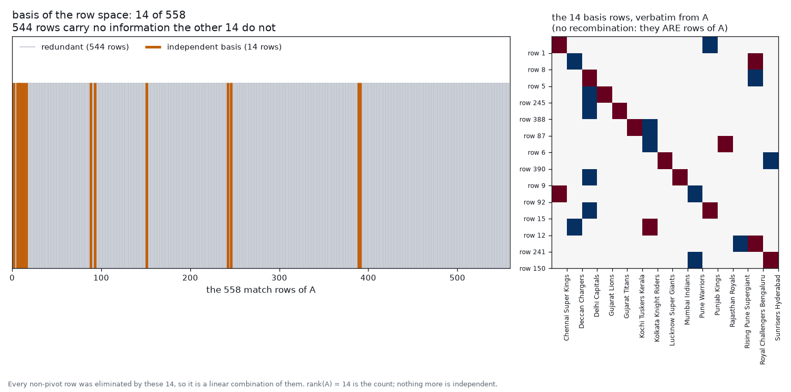

Which of the 558 match rows became pivot rows (kept) and which did not
(combinations of them). **Point:** of 558 equations, only 14 are independent;
the other 544 are combinations. Linear dependence, made visible.

## Stage 6 — ORTHOGONALIZATION

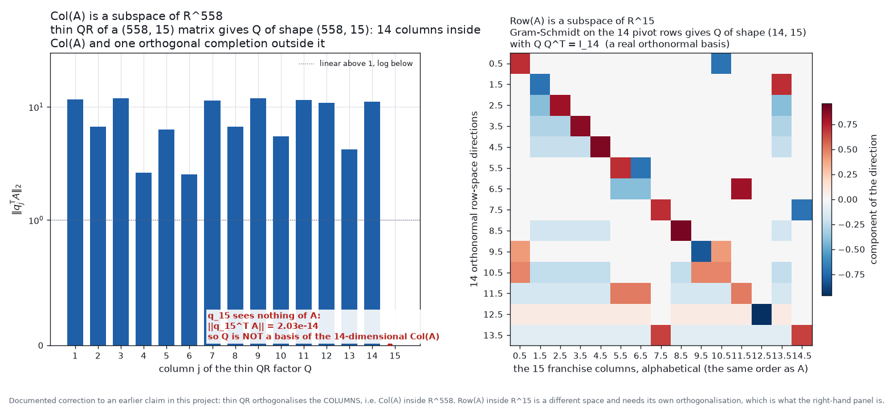

Side view of the *two different spaces*. Left: `‖qⱼᵀA‖` for all 15 columns of
the thin QR of `A` — the first 14 are singular values of `A`, the 15th is ~0
because that direction sees nothing of `A`. Right: the Gram–Schmidt basis of
`Row(A)` in R¹⁵. **Point:** thin QR orthogonalises the *columns* (Col(A) ⊂
R⁵⁵⁸), Gram–Schmidt on the pivot rows orthogonalises the *rows* (Row(A) ⊂
R¹⁵). They are not the same space — this project once conflated them.

## Stage 7 — PROJECTION

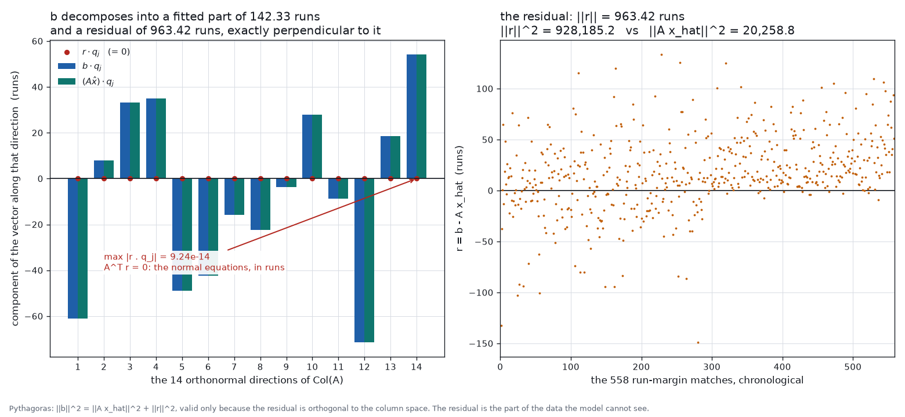

`b·qⱼ` against `(Ax̂)·qⱼ` for all 14 in-column-space directions, beside the
residual over the matches. **Point:** least squares is an orthogonal
projection — `r` is perpendicular to every direction in Col(A), and the
residual is ~6.8× longer than the part of `b` that was projected.

## Stage 8 — PREDICTION / LEAST SQUARES

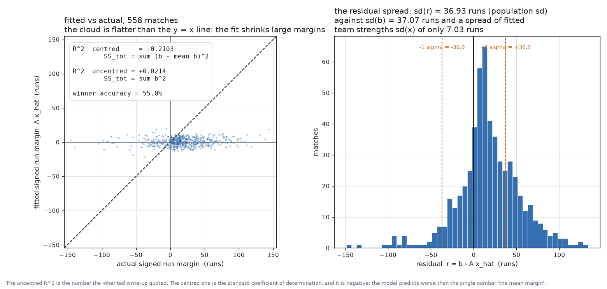

Two panels. Left: every match's fitted margin against its actual margin, with
the `y = x` line — the cloud is a cigar tilted the wrong way and centred away
from the origin, with **both** R² values annotated, each labelled with its
denominator. Right: the residual distribution, one standard deviation marked,
plus the winner-accuracy line. **Point:** the negative centred R² (−0.2103) is
the missing intercept (`A @ 1 = 0`), not noise — add the one column and R²
moves to +0.0181, still no signal. Winner accuracy 55.02% vs the
majority-class baseline 77.96%: negative skill.

## Stage 9 — PATTERN DISCOVERY (eigenvalues)

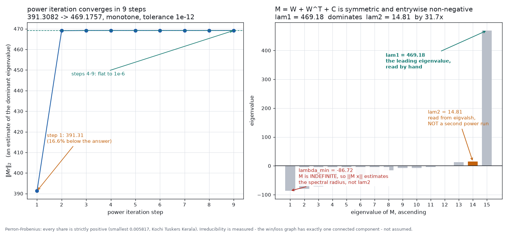

The power-iteration convergence trace `‖Mr‖` per step, beside the full
spectrum of `M`. **Point:** λ₁ dominates (λ₁/λ₂ ≈ 31.7), the trace converges,
and the smallest Colley share is > 0 — strictly positive, as Perron–Frobenius
requires for a matrix whose win/loss graph is one component. All 1,218 decided
matches, not just 558.

## Stage 10 — SYSTEM SIMPLIFICATION

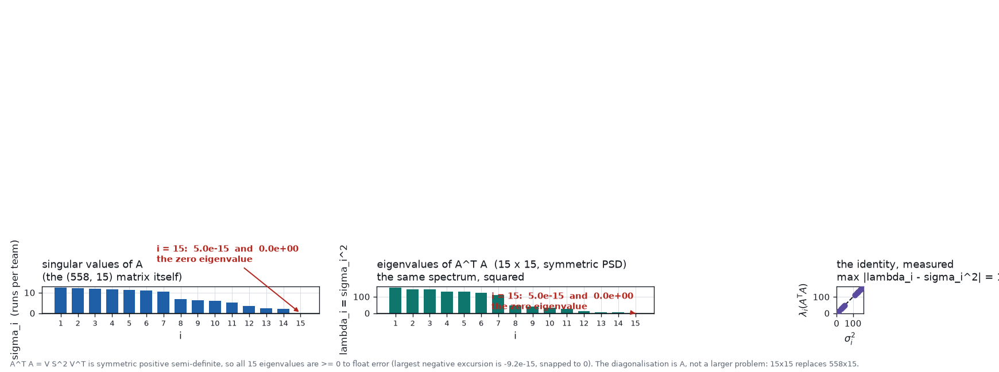

Three panels — σᵢ per index, λᵢ = σᵢ² per index, and σᵢ² plotted against the
eigenvalues of `AᵀA` on the y = x line. **Point:** the eigenvalues of `AᵀA`
*are* the squared singular values of `A` — the 15×15 system is `A` rotated and
squared, which is the symmetry-based view of the same rank-14/nullity-1 fact.

## Stage 11 — FINAL APPLICATION OUTPUT

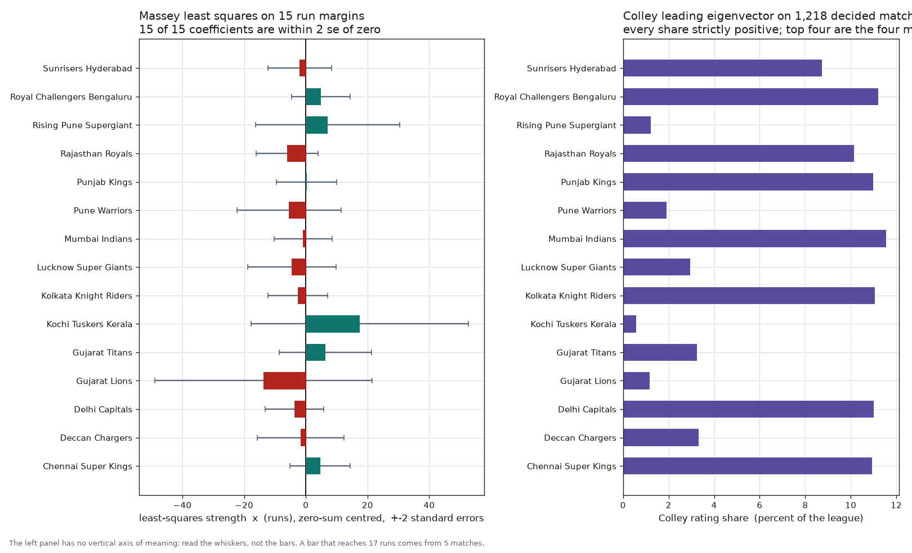

The two rankings — Massey ±2·se whiskers beside Colley rating shares, 15
franchises each.

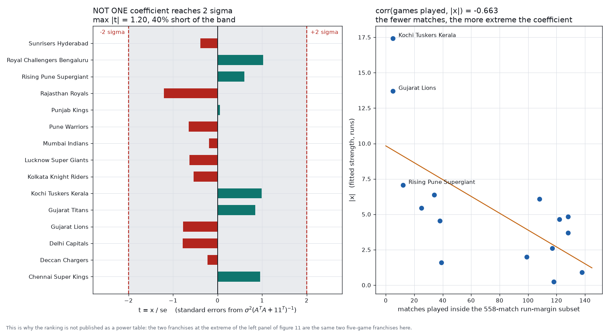

Every coefficient's t-statistic against the 2σ band (none reaches it), beside
games played against |x|.

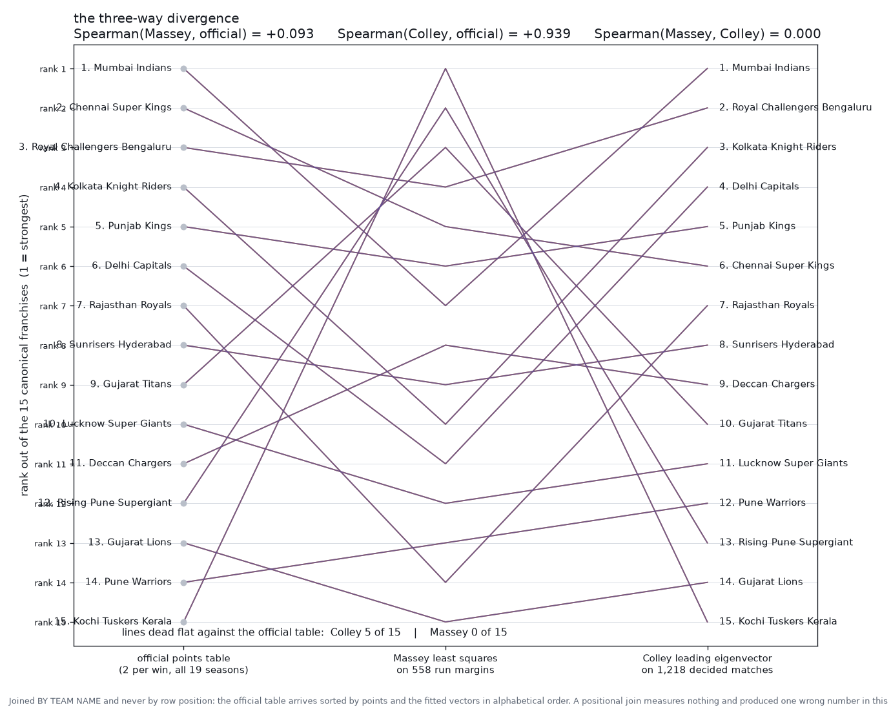

Official table vs Massey vs Colley as one slopegraph. **The payoff figure:**
Colley tracks the official table (Spearman +0.939), Massey does not (+0.093),
and the two models are mutually uncorrelated (Spearman exactly 0) on the same
15 teams.

## The text blocks between the figure panels

- **R² block:** prints *both* denominators, centred (−0.2103) and uncentred
  (+0.0214), each labelled, plus the +0.0181 intercept correction. Never one
  R² alone.
- **Findings:** the demo's stated result, including the refuted
  frequency-balancing hypothesis (`max|x|` made *worse*: 17.43 → 25.64).
- **Comparison table:** per-team official points, Massey rank, Colley rank.
- **Provenance:** the snapshot hash, the fetch date, the "archive hash not
  retained" note, and the not-asserted licence.

> See [10-known-issues.md](10-known-issues.md): the Massey numbers in items
> 11-ranking/12-findings/06 are under review for the sign-convention finding.
